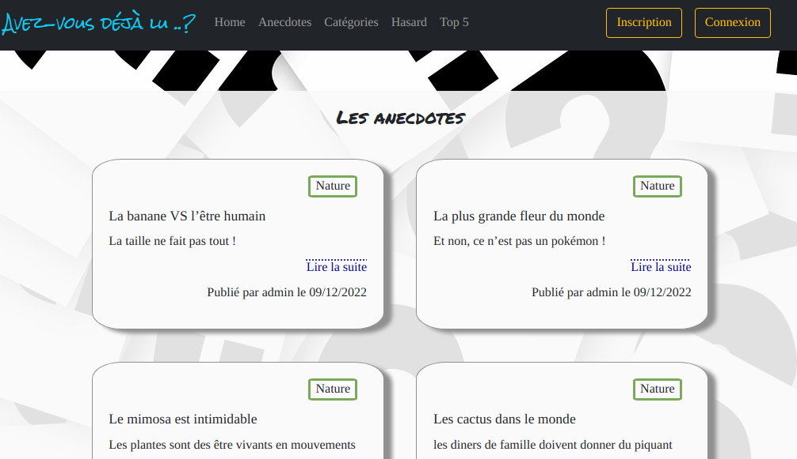
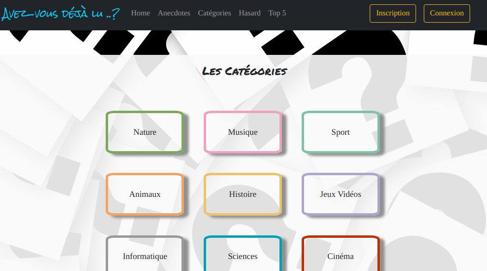
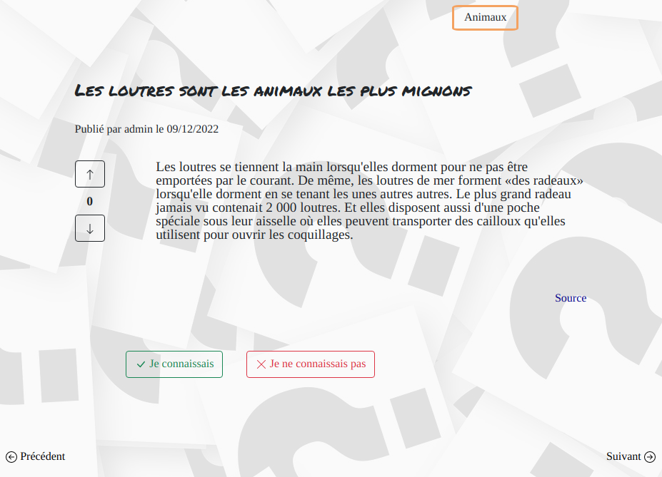
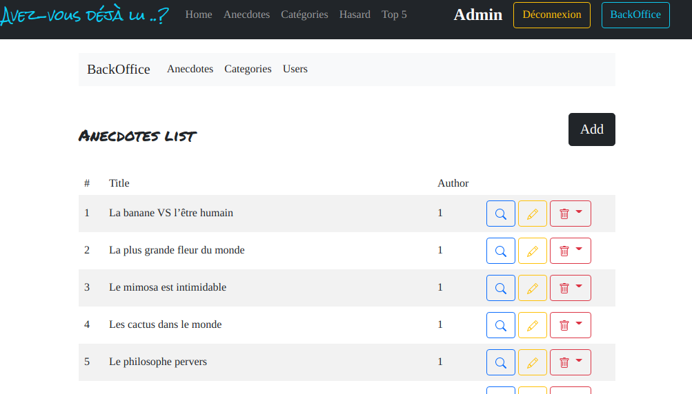

# Avez-vous déjà lu..?

Whether for people already cultured or not, "Avez-vous déjà lu..?" project is an application simple and easy to use whose content is focused on general culture through anecdotes.
The project responds to the user's need to diversify its content in terms of general culture through short and playful references.

## Rendering examples

### 1. Anecdote list

<kbd></kbd>

### 2. Categories list

<kbd></kbd>

### 3. Anecdote read

<kbd></kbd>

---

### Technologies

Front-end :

- Bootstrap
- Javascript
- AJAX

Back-end :

- Bootstrap
- PHP (API REST)
- Database management system (DBMS) : MySQL

Data management with a back office for administrators.

>  **Back office rendering** > BREAD fonctionnaly for Anecdotes, categories and users.

<kbd></kbd>
